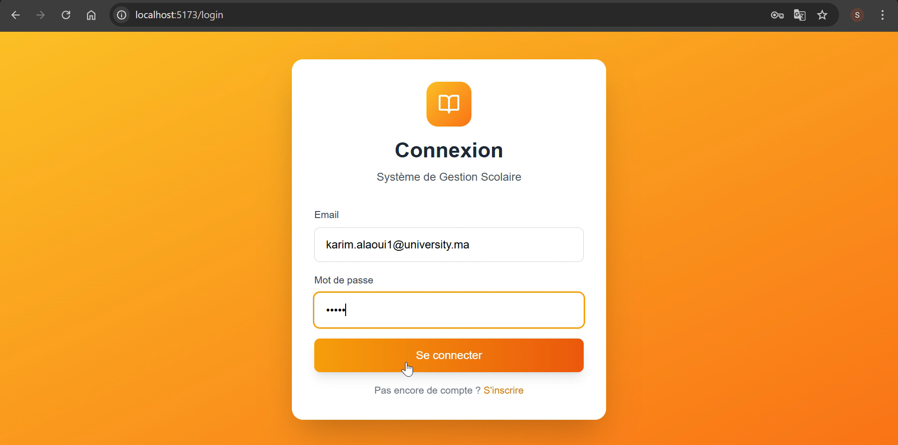
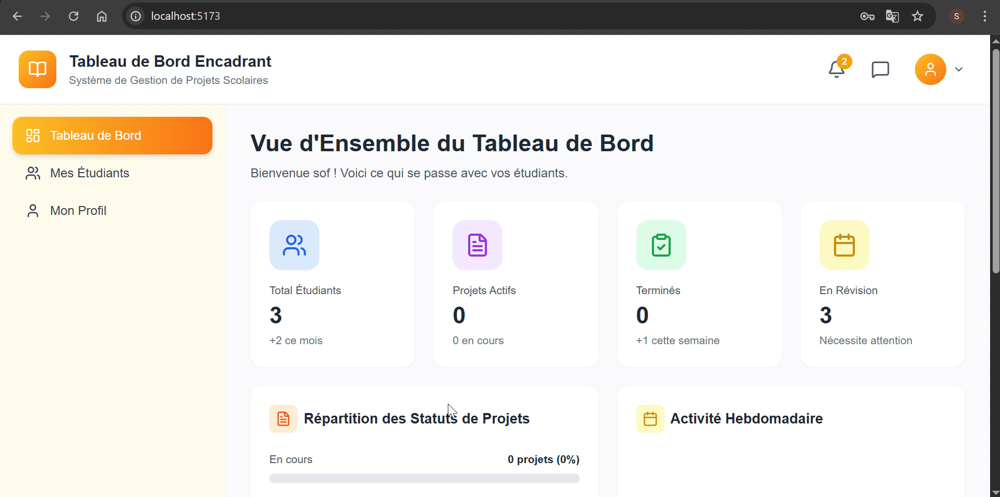
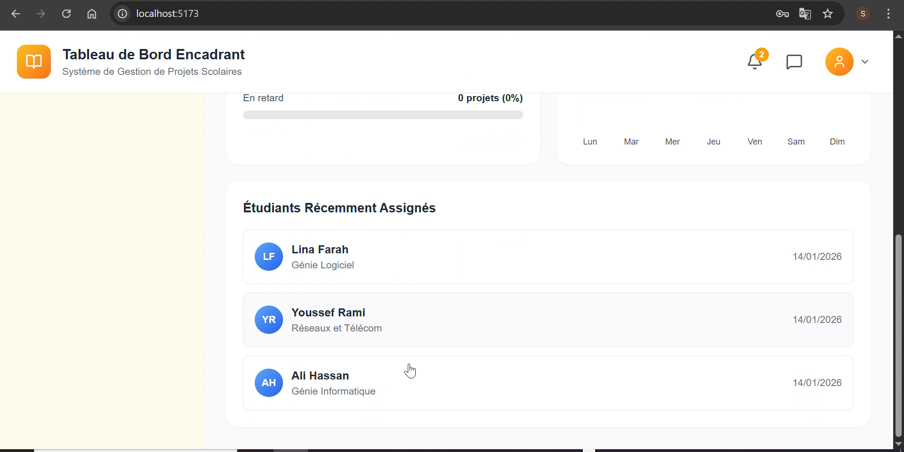
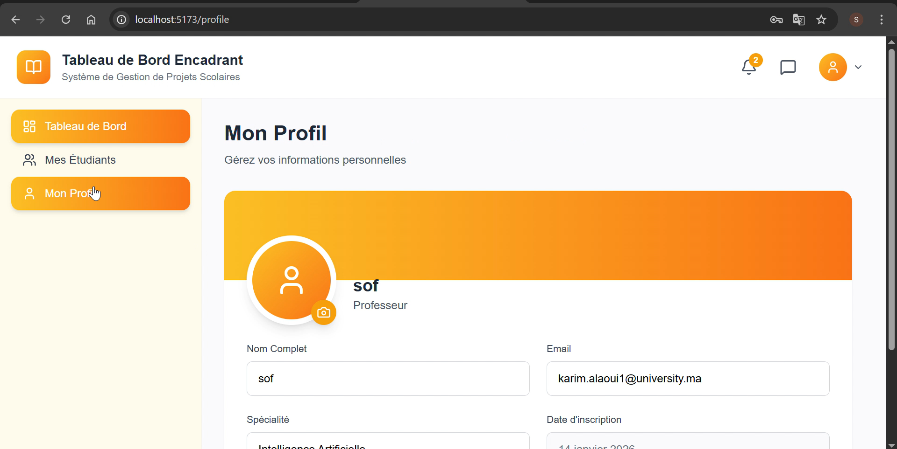

#  Espace Encadrant – Vue.js & Spring Boot

Ce dépôt contient **ma contribution personnelle** au projet de **gestion académique**, dédiée à l’**espace encadrant**, développée avec **Vue.js (frontend)** et **Spring Boot (backend)**.

---

##  Description

L’espace encadrant permet à un encadrant (enseignant / superviseur) de :

- Se connecter à son espace personnel
- Accéder à un **dashboard** récapitulatif
- Consulter et gérer son **profil**

Cette partie du projet communique avec le backend via une **API REST**.

---

##  Technologies utilisées

###  Frontend
- Vue.js 3
- Vite
- Axios
- Vue Router
- Tailwind CSS

###  Backend
- Spring Boot
- Spring Security
- Spring Data JPA
- REST API
- MySQL 

---

##  Fonctionnalités

- Authentification de l’encadrant (login)
- Accès au dashboard encadrant
- Consultation et mise à jour du profil
- Communication sécurisée Frontend ↔ Backend

---

##  Aperçu de l’interface

###  Page de connexion

### 📊 Dashboard encadrant

###  Profil encadrant

